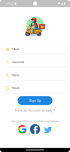
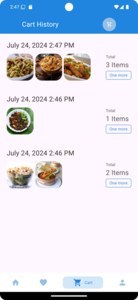

# Blink : Food Delivery App

A food delivery app built with Flutter, leveraging GetX for state management and a Laravel backend. This app provides users with an intuitive and engaging interface to browse, order, and enjoy their favorite meals from various restaurants.

## Features

                                                              
  
                                

                                

                 

## Demo

Here is a video demonstration of all the features:


## Technologies Used

- **Frontend**: Flutter
- **State Management**: GetX
- **Backend**: Laravel
- **Maps API**: Google Maps API

## Getting Started

### Prerequisites

- Flutter SDK
- Dart SDK
- Laravel

### Installation

1. Clone the repository:

    ```bash
    git clone https://github.com/midhun192/Food_Delivery_App.git
    cd food-delivery-app
    ```

2. Install Flutter dependencies:

    ```bash
    flutter pub get
    ```

3. Set up Laravel backend:

    - Follow the instructions in the backend repository or section.

4. Run the app:

    ```bash
    flutter run
    ```

## Usage

- **Browse Recommended Foods**: Explore a curated list of recommended dishes on the homepage.
- **View Popular Foods**: See what's popular among other users.
- **Manage Favorites**: Add or remove items from your favorites list.
- **Shopping Cart**: Add items to your cart and proceed to checkout.
- **Address Selection**: Use the address selection feature to choose your delivery address via Google Maps.
- **User Registration and Login**: Register using your phone number or email, and log in with your phone number.
- **Order History**: View a history of all your previous orders.

## Acknowledgements

- Flutter and the Flutter community
- GetX for state management
- Laravel for the backend framework
- Google Maps API for address selection functionality

A few resources to get you started if this is your first Flutter project:

- [Lab: Write your first Flutter app](https://docs.flutter.dev/get-started/codelab)
- [Cookbook: Useful Flutter samples](https://docs.flutter.dev/cookbook)

For help getting started with Flutter development, view the
[online documentation](https://docs.flutter.dev/), which offers tutorials,
samples, guidance on mobile development, and a full API reference.
